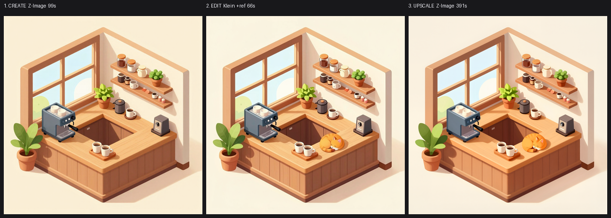
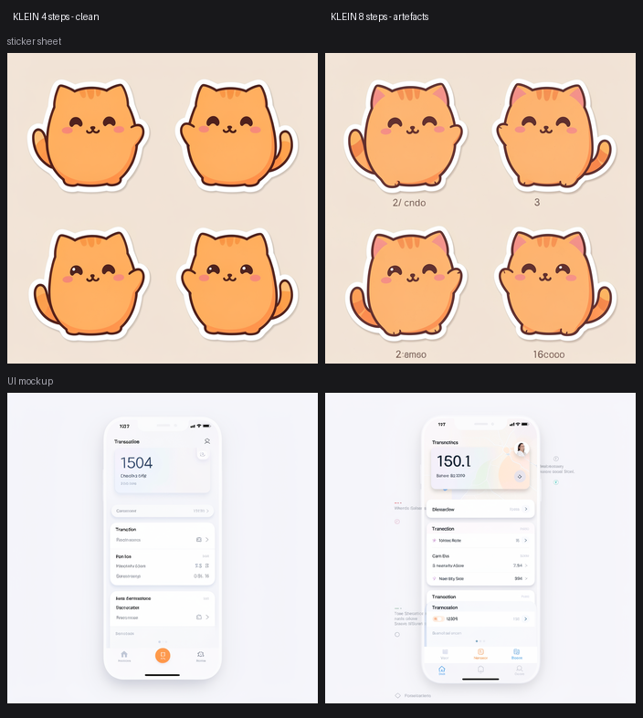
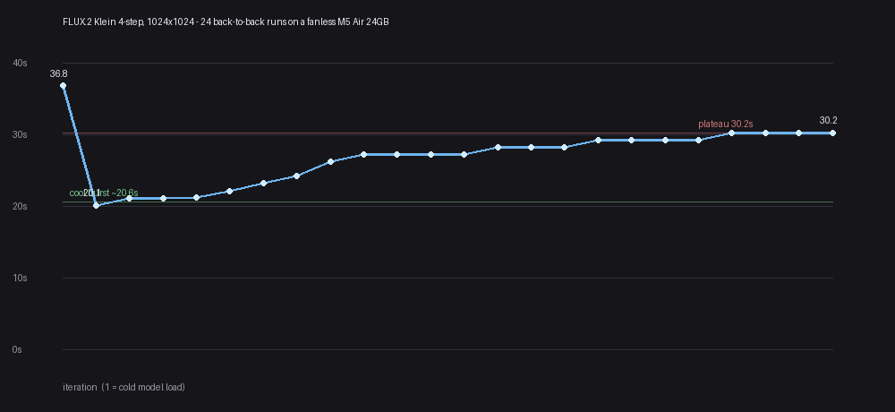
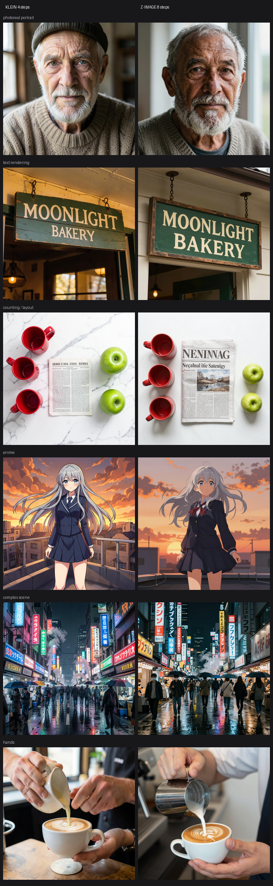
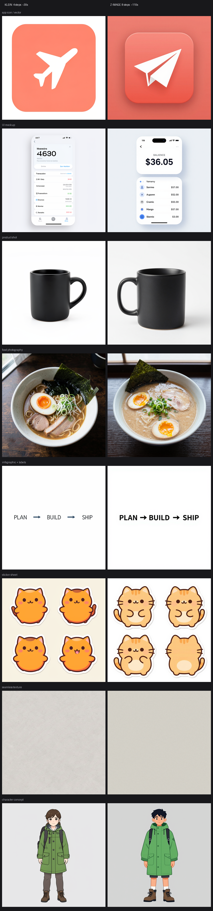
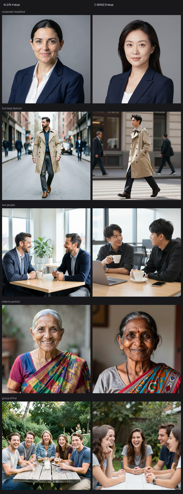
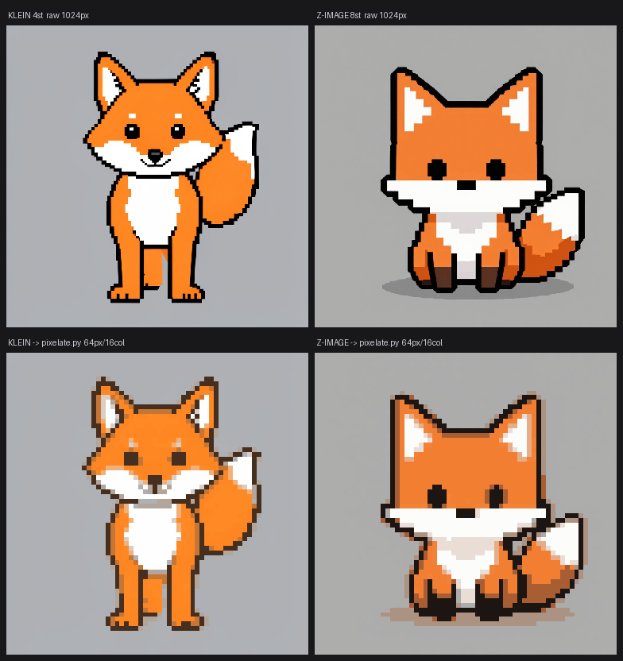
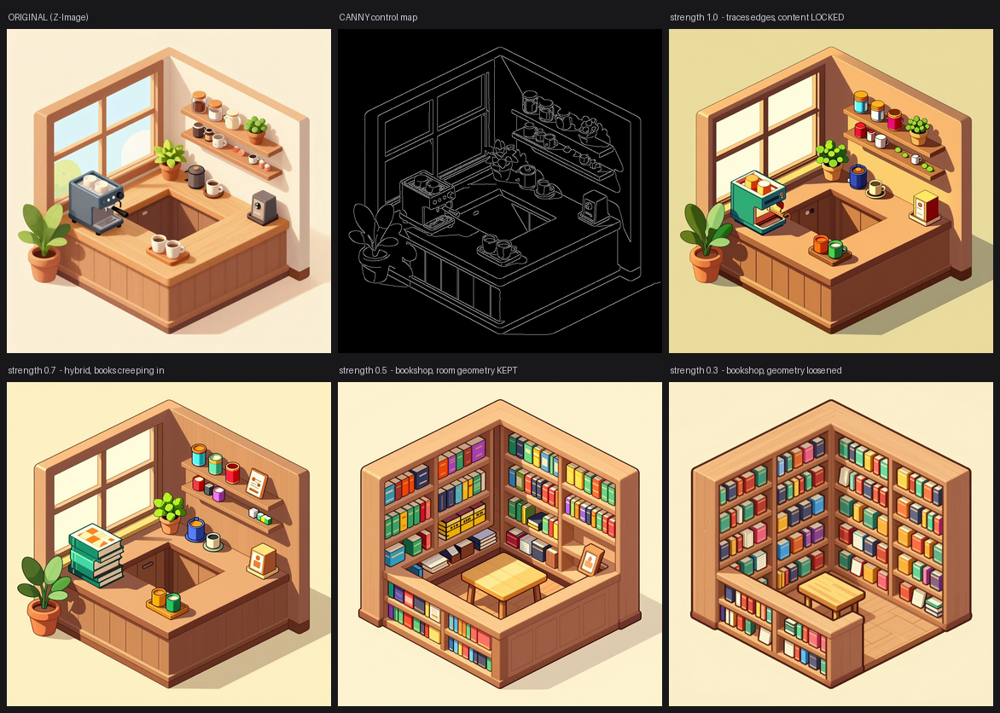
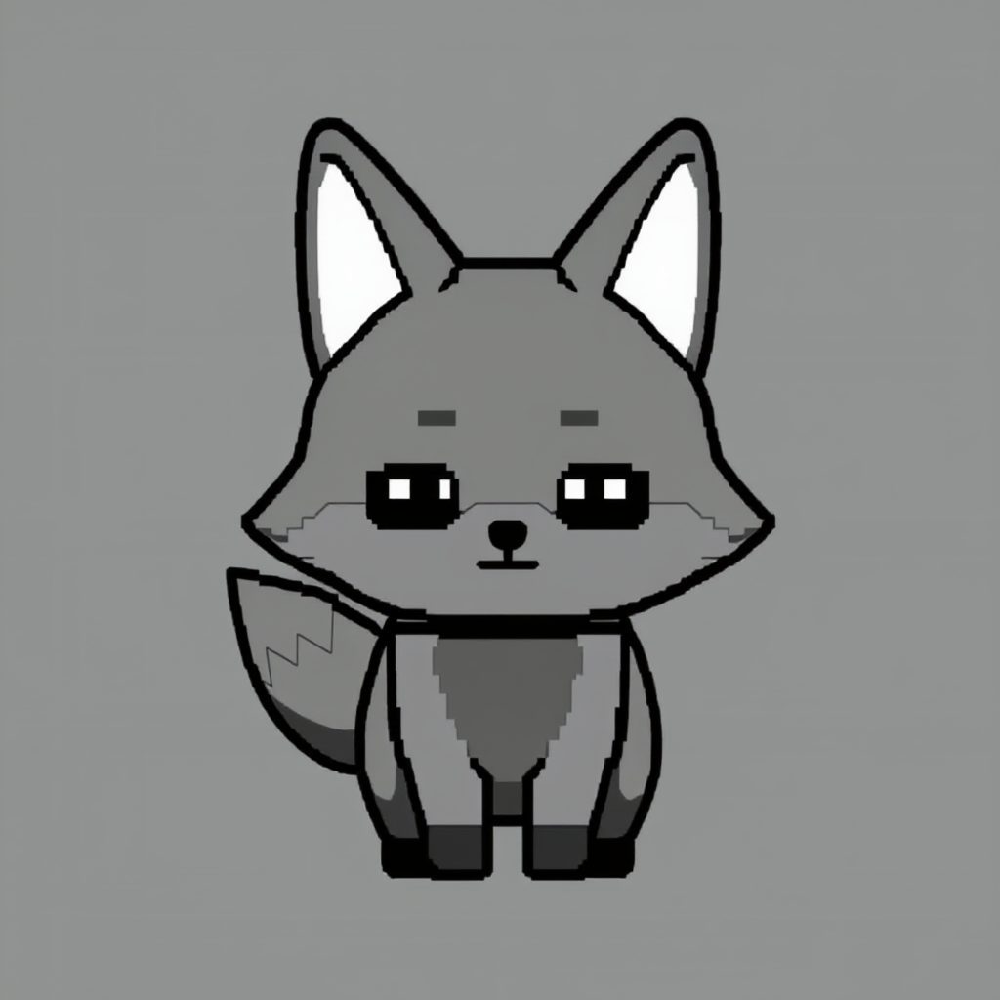

# How to Run Image Generation Locally on a MacBook

*No GPU. No subscription. No uploads. A fanless MacBook Air with 24 GB of unified memory.*



That coffee shop was generated, edited, and upscaled to 2048×2048 on an M5 MacBook Air in **9 minutes 16 seconds** — three stages, two different models, nothing leaving the machine.

This is the setup guide I wish I'd had. Everything below is verified on the machine described, including the settings that are wrong in the official templates.

Total download: **~20 GB**. Setup time: about an hour, mostly waiting.

> **Everything in this guide — the seven ComfyUI workflows, the model downloader, and the CLI scripts — is here:**
> **[github.com/Sajith-K-Sasi/comfyui-mac-imagegen](https://github.com/Sajith-K-Sasi/comfyui-mac-imagegen)**
>
> Clone it and skip to Step 3.

---

# Part 1 — Setup

## What you need

- **Apple Silicon Mac.** 24 GB unified memory recommended. 16 GB will thrash — free memory bottomed at 1.99 GB here during upscaling.
- **~20 GB free disk.**
- Command line comfort. No Python knowledge required.

## Step 1: Install ComfyUI

[ComfyUI](https://github.com/comfyanonymous/ComfyUI) is the node editor that runs the models.

```bash
git clone https://github.com/comfyanonymous/ComfyUI
cd ComfyUI
python3 -m venv venv
source venv/bin/activate
pip install torch torchvision torchaudio
pip install -r requirements.txt
```

On Apple Silicon, plain `pip install torch` gets you MPS (Metal) acceleration — no CUDA, no extra index URL. Verify:

```bash
python -c "import torch; print(torch.backends.mps.is_available())"
# True
```

## Step 2: Add the GGUF loader

Every model here is GGUF-quantised — that's what makes them fit in 24 GB. ComfyUI needs [one custom node](https://github.com/city96/ComfyUI-GGUF) to read them.

```bash
cd custom_nodes
git clone https://github.com/city96/ComfyUI-GGUF
pip install -r ComfyUI-GGUF/requirements.txt
cd ..
```

## Step 3: Download the models

```bash
git clone https://github.com/Sajith-K-Sasi/comfyui-mac-imagegen
cd comfyui-mac-imagegen
./download-models.sh /path/to/ComfyUI
```

The script is resumable — if your connection drops, re-run it and it picks up from the last byte. (Worth noting: it deliberately avoids `curl --retry`, which restarts transfers and silently truncates multi-GB downloads. That cost me 1.25 GB before I caught it.)

Skip the 2.9 GB ControlNet if you don't need structural control:

```bash
./download-models.sh /path/to/ComfyUI --core-only
```

Here's what lands where:

| File | Size | Location | Purpose |
|---|---|---|---|
| `flux-2-klein-4b-Q8_0.gguf` | 4.3 GB | `models/diffusion_models/` | fast generation + editing |
| `z-image-turbo-Q6_K.gguf` | 5.9 GB | `models/diffusion_models/` | cleaner generation |
| `Qwen_3_4b-Q6_K.gguf` | 3.3 GB | `models/text_encoders/` | **shared by both models** |
| `flux2-vae.safetensors` | 0.3 GB | `models/vae/` | Klein decoder |
| `z_image_ae.safetensors` | 0.3 GB | `models/vae/` | Z-Image decoder |
| `RealESRGAN_x4plus.safetensors` | 67 MB | `models/upscale_models/` | upscaling |
| ControlNet Union | 2.9 GB | `models/model_patches/` | structural control |

Two things people get wrong here. **One text encoder serves both models** — Z-Image and Klein 4B both condition on Qwen3-4B, and ComfyUI just swaps the tokenizer template. Don't download two. But the **VAEs are not interchangeable**; they use different latent formats, and crossing them produces garbage.

## Step 4: Install the workflows

```bash
cp workflows/*.json /path/to/ComfyUI/user/default/workflows/
```

Seven workflows: text-to-image for each model, reference editing, inpainting, pixel art, 2K upscaling, and ControlNet.

## Step 5: Run it

```bash
cd /path/to/ComfyUI
source venv/bin/activate
python main.py
```

Open http://127.0.0.1:8188, pick a workflow from the sidebar, hit Run. First generation loads the model into memory (~37s); after that it's ~30s per image.

## Optional: drive it from the command line

ComfyUI has an HTTP API, so you can script it — handy for batches, or for letting a coding agent generate its own placeholder assets.

```bash
./gen.py "a red ceramic teapot on a wooden table, soft window light"
./gen.py "same teapot, side view" --ref teapot.png     # reference-guided edit
./upscale.py output/teapot_00001_.png -o teapot_2k     # 1024 → 2048
./pixelate.py image.png -s 64 -c 16                    # snap to a real pixel grid
```

---

# Part 2 — The settings that matter

These are not defaults. Two of them are wrong in the official templates, and the first one costs you 3× the time *and* worse images.

## Klein: 4 steps, cfg 1.0, euler

The 4B distilled model is **step-distilled to 4**. More steps don't refine — they over-cook.

I was running 20. My inpainting workflow was at 25.

| Steps | Noise σ | Time |
|---|---|---|
| **4** | **5.08** | **32s** |
| 8 | 5.18 | 85s |
| 20 | 5.59 | 107s |
| 32 | 5.76 | 265s |

Grain rises *monotonically* with steps — backwards from the usual intuition, and it held across every sampler I tried.

Also: don't wire up `FluxGuidance`. The distilled checkpoint has no guidance tensors, so it's a byte-for-byte no-op.

*(If you load `flux-2-klein-base-4b` — a different model — it needs 20 steps and cfg 5.)*

## Z-Image: 8 steps, cfg 1.0, simple scheduler

euler or `res_multistep` both work. Keep cfg at 1.0; it's distilled, and raising it degrades output.

`ModelSamplingAuraFlow(3.0)` appears in the official templates but is **redundant** — the model config already applies shift 3.0. Verified: byte-identical output with and without.

## ControlNet: strength 0.3–0.5, not 1.0

The template ships 1.0, which is the setting least suited to what most people want.

| Strength | Result |
|---|---|
| 1.0 | Traces every edge. Content **locked** — asked for a bookshop, got the same coffee shop recoloured |
| 0.7 | Hybrid; books start appearing |
| **0.5** | **Bookshop, original room geometry intact** |
| 0.3 | Bookshop, geometry loosened, best-looking |

## `VAEDecodeTiled` above ~1500px

Plain `VAEDecode` dies on Apple Silicon at 2048² with `MPSGraph does not support tensor dims larger than INT_MAX`. The upscaler workflow already uses tiled decode.

## Prompt length differs between the models

Klein wants **descriptive** prompts — 100–400 words per BFL's guidance. Given "a photorealistic hamster" it produced a rat. Z-Image is accurate from a handful of words.

---

# Part 3 — What the benchmarks showed

Everything above is what to do. This is why.

## The failure the metric couldn't see

I nearly published "8 steps is ~7% grainier" and moved on. Then I looked at the actual images.



At 8 steps, on a sticker sheet, Klein **invented caption text under three of four stickers** — "2/ cndo", "3", "16cooo". Nothing in the prompt asked for text. On a UI mockup: ghost text bleeding outside the phone frame, duplicated cards, two stacked tab bars.

At 4 steps, both are clean.

My noise metric rated that difference at **+0.0%**. Flat graphic art has almost no high-frequency energy, so a noise estimator has nothing to measure. It was structurally blind to the failure that matters most for design work.

**Over-cooking a distilled model doesn't just add noise — it fabricates content that isn't in your prompt.**

## Speed: the number nobody publishes

Most local-gen posts quote one warm generation time. On a fanless chassis that's misleading.



24 back-to-back generations, identical settings, different seeds:

| Phase | Time/image |
|---|---|
| Cold start (model load) | 36.8s |
| **Cool burst** (runs 2–5) | **20.9s** |
| Ramp (runs 6–20) | 22 → 29s |
| **Sustained plateau** (runs 21–24) | **30.2s** |

**+45% from burst to sustained** — then it flattens and stays flat. Four consecutive runs at exactly 30.2s. It throttles, but it doesn't spiral.

Free memory *rose* slightly while times climbed, which rules out memory pressure and points squarely at thermals.

Plan for **~30s/image sustained**, not the ~21s a two-image test suggests.

## Which model for which job

Both at correct settings, same prompt, same seed. Klein ≈ **31s**, Z-Image ≈ **109s**.





Findings marked ✓ were re-run across four seeds. Everything else is a **single sample** — read those as impressions, not measurements. The distinction turned out to matter.

**Z-Image wins:**
- ✓ **Cleaner output.** ~2.3× less grain — cleaner in **11 of 12** seed × category runs, roughly 2.5× on portraits. The most robust difference between the two.
- ✓ **Single-subject anatomy.** On "a barista's hands," Z-Image was correct **4/4**; Klein **1/4**.
- **Short prompts** (n=1). "a photorealistic hamster" → a hamster, not a rat.
- **UI mockups** (n=1). "BALANCE" and "$36.05" render legibly; Klein's were mush.

**Klein wins:**
- ✓ **Speed.** 3.5× faster, and consistent — 30–34s across seven runs.
- **Multi-person scenes** (n=1). Five people, all faces visible. Z-Image obscured two.
- **Commercial product shots** (n=1). E-commerce-ready in 30 seconds.
- **Editing.** It's the only option.

One tendency explains both anatomy results: **Klein over-populates.** Asked for one barista's two hands, it added a second person in 3 of 4 seeds. Asked for five friends, that same instinct gave five clean faces where Z-Image struggled. Want a crowd, use Klein. Want one subject, use Z-Image.

**Both fail:** dense small text. Three words on a sign render perfectly. Twenty tiny UI labels turn to gibberish in both.



## The answer wasn't "pick one"

The head-to-head kept ending in "close, depends." The pipeline question had a clear answer.

**Create with Z-Image → edit with Klein → upscale with Z-Image.**

Look again at the top image. Stage 2 preserved the espresso machine, shelf jars, both plants, the grinder, window, wood grain and lighting — and added one sleeping cat, matched to the art style. **66 seconds.**

Z-Image cannot do that edit at all. Worth stating plainly, because several posts imply otherwise: **Z-Image cannot edit images.** Omni and Edit are not publicly released — Tongyi-MAI publishes only `Z-Image` and `Z-Image-Turbo`, both text-to-image. ComfyUI ships the nodes; the weights don't exist yet.

## Pixel art: where the post-process beats the model



Straight out of the model, Z-Image is closer to a real pixel grid:

| | grid-RMSE | in-cell variance |
|---|---|---|
| Klein 4 steps | 35.65 | 10.52 |
| **Z-Image 8 steps** | **28.75** | **8.93** |

Neither is *actually* pixel art — both are 1024px images that look pixel-ish, with 23,000 and 30,000 distinct colours where a real 16-bit sprite has sixteen.

So you post-process: area-average downsample to 64px, median-cut to a fixed palette, no dithering. After that both land at 16 colours with edge hardness 12.19 vs 12.09.

**The 24% gap closes to under 1%.** Forty lines of Pillow erased the difference the models spent 90 seconds arguing about. For sprite work, the palette quantiser decides the look — so use the faster model.

## ControlNet: pose control for consistent sprites



At 1.0, canny is a *recolour* tool, not a reimagining tool. For content changes, 0.3–0.5 is the working range.

The sprite case is where this earns its keep. My 2×2 sprite sheet kept producing four near-identical front views, because prompts don't control geometry. With ControlNet: same silhouette, same pose, different character.



For pixel art, lower strength is *better* — 0.6 gave cleaner edges than 1.0 while still holding the pose.

---

A fanless laptop with no GPU now creates, edits, and upscales images locally, in about the time it takes to make coffee. That's a genuinely new capability, and it's about 20 GB of downloads away.

Everything here — workflows, download script, CLI tools — is in [this repo](https://github.com/Sajith-K-Sasi/comfyui-mac-imagegen).

The full-resolution originals behind these comparisons are in [`blog/originals/`](originals/). Each one carries its complete ComfyUI workflow in the PNG metadata — drag it onto the canvas and the exact settings come back.

---

*All timings measured on an M5 MacBook Air, 24 GB, ComfyUI 0.28.0, PyTorch 2.13, MPS, Python 3.14. Every image in this post was generated on that machine.*
